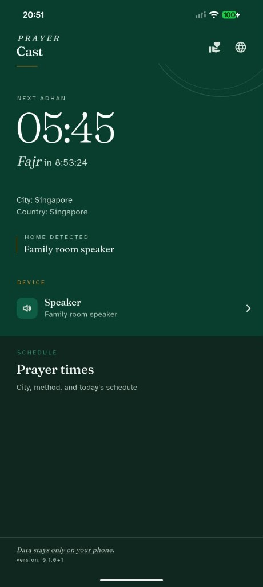
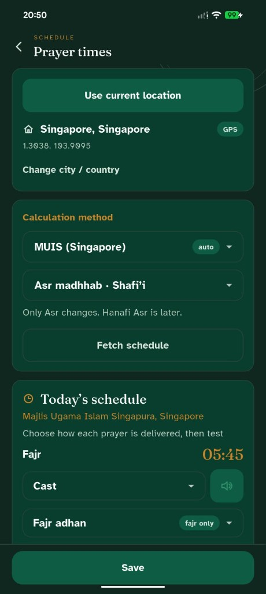
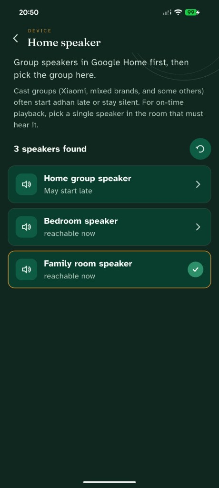

# Prayer Cast

Tursina Labs — prayer times on your phone, and adhan on a home speaker when
you are actually home. No account, no ads, no in-app purchases.

[Google Play](https://play.google.com/store/apps/details?id=com.tursinalabs.prayer_cast)
· [Privacy policy](https://tursinalabs.com/privacy/prayer-cast)
· [Support on Ko-fi](https://ko-fi.com/hendrawandaryonokarso)

## Screenshots

| Home | Prayer times | Home speaker |
| --- | --- | --- |
|  |  |  |

## What it does

**Prayer times**

- Schedule for your city from Aladhan. Location is optional — you can type
  city and country instead.
- In Indonesia, Kemenag jadwal comes from myQuran using a city id only, with
  an automatic fallback to Aladhan if myQuran is unavailable.
- Singapore MUIS (method 11), and Hanafi / Shafi'i Asr.
- Change the city when you travel so the schedule follows you.

**Adhan delivery**

- Per-prayer delivery: Cast to the home speaker (default), beep on the phone,
  takbir on the phone, or adhan on the phone.
- Fajr uses a separate Fajr adhan; other prayers use the standard adhan.
- If Cast fails or you are away, the prayer falls back to the phone when that
  prayer is set to beep or phone adhan. Otherwise the phone stays silent.
- "Test scheduled adhan" arms a real alarm one or five minutes out, so you can
  exercise the whole wake / presence / cast path instead of just the speaker.

**Home speaker**

- Scan the local network and pick a Google Cast / Nest speaker, including
  groups you already made in Google Home. Smart TVs are hidden.
- Cast groups often start late or stay silent, so the picker labels them and
  recommends a single speaker in the room that must hear the adhan.

**Also in the app**

- Iqamah reminder per prayer, with a silent or chime sound.
- Prayer tracker with stats, and a next-prayer home screen widget.
- Qibla compass and nearby mosques on OpenStreetMap.
- Adhan history — the last 30 delivery attempts and why each one succeeded
  or failed, stored on the phone only.
- Spiritual benefits and sunnah practices for each prayer.
- English and Indonesian.

## How "home" works

Home detection is an on-device Wi-Fi / LAN fingerprint, not GPS. GPS is only
ever used when you tap "Use current location" on Prayer times (to fill city
and country) or open Nearby mosques. The speaker scan does not use location.

## Privacy

Prayer preferences, the saved speaker id, the tracker, and delivery logs stay
on the phone. Tursina Labs does not run a backend for this app. Optional
location is sent only to Aladhan, myQuran (Indonesia Kemenag city id), the
system geocoder, and OpenStreetMap (Overpass / Nominatim) for mosques.

Ko-fi is a donation opened in the system browser. It does not unlock features
and is not an in-app purchase.

## Support

Prayer Cast is free, with no ads and no in-app purchases. If it is useful to
you, a donation helps keep it maintained:

[](https://ko-fi.com/hendrawandaryonokarso)

## Develop

```bash
flutter pub get
dart run build_runner build --delete-conflicting-outputs
flutter gen-l10n
flutter test
```

Icons / splash after changing `assets/icons/`:

```bash
dart run flutter_launcher_icons
dart run flutter_native_splash:create
```

Install a debug APK without wiping data:

```bash
flutter build apk --debug
adb install -r build/app/outputs/flutter-apk/app-debug.apk
```

Do not use `flutter install` unless you intend a release build — it can
pick a stale `app-release.apk` and uninstall the app (data wipe). After
any install, open the app once so the next prayer is scheduled.

Release build:

```bash
flutter build appbundle --release
```

Do not install a release build over a debug build on a phone with live
alarms. The signatures differ, so Android forces an uninstall and the
schedule is lost.

## Tests

```bash
flutter test
```

Around 60 test files cover presence, delivery, scheduling, and the settings
and speaker UI.

## Layout

```
lib/home_delivery   presence, Cast delivery, scheduling, logging, settings UI
lib/prayer_times    Aladhan / myQuran clients, prefs, schedule UI
lib/prayer_tracker  tracker store and stats
lib/qibla           compass, bearing, nearby mosques
lib/l10n            English and Indonesian ARB files
android/app         alarms, foreground service, widget, Cast host
```

## License

Copyright Tursina Labs. Source in this repository is for the Prayer Cast
app and is not offered under an open-source license.
